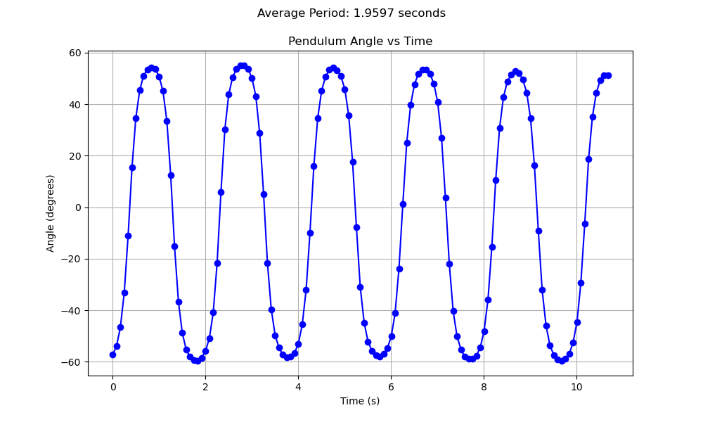

# PHY180 -- Pendulum Motion Tracker

This project utilizes OpenCV's Trackers API to develop an automated tracking system for processing recorded images of pendulum motion. You should put all the video you wish to process in one directory and the program will automatically process all the files.

**An angle-time graph will be produced with average period, while logging X, Y, and angle to a csv file.** For each video there will be one csv file and one graph in the `ouput/` directory.




> The code is open source and feel free to fork and use it for your project. However, please credit the creator if the code was used as a part of any academic assignment.

## Input Requirements

It is very important to note that input video are intended to be at _**60fps**_. Technically it would work for all other framerates (30 or 240) but this could cause unexpected errors or a wrong time scale.

> NOTE: This might be fixed in future patches. Please create a GitHub Issue if you run into difficulties.

## Contact Me

If you wish to contribute or have questions, reach out to [my email](jetjiang.ez@gmail.com). The project might not be actively maintained but I am happy to help if possible.

## Requirements

OpenCV is originally a C computer vision library written in C++, but its Python API is much more convenient in development. You need to install the package in order to run this script.

```
pip install opencv-python
conda install opencv
```

**For your convenience, you can initialize a new virtual environment using the requirement files we generated.** If you don't know how to use either Google or ChatGPT can help.

```
pip install -r requirements.txt
conda env create -f environment.yaml
```

## Usage

The following script will process all the files in the specified directory:

```
python3 tracker.py --tracker <tracker_type> --source <path-to-videos> --show <True/False>
```

The tracker is defaulted to `KCF` (Kernalized Correlation Filter). All available options for OpenCV 4.0+ are: `tracker_types = ['BOOSTING', 'MIL','KCF', 'TLD', 'MEDIANFLOW', 'GOTURN', 'MOSSE', 'CSRT']`.

> If you don't wish to show the video being tracked, set `--show` to `False`.

The user will be prompted to:

- Use your mouse to click on the first frame to select the origin to adjust x-y coordinates

- Draw a bounding box on the region of interest (ROI) (i.e. the object you want to track)

- Click `Esc` if you want to quit the video midway, otherwise it will exit when finished

- The next video will begin automatically and the process repeats until all videos are processed

Calling main tracker script will automatically generate plots in the output directory. If you want to plot a specific CSV file, you can do that with `python3 plotting.py`. Since you will rarely be calling this manually, argparse wasn't implemented so just modify the file path using a text editor.

## Known Issues

### OpenCV Version

OpenCV has a very bad API maintenace and legacy support. Once a new version is released, certain API calls are changed / deprecated. This is why if you are using an older version the script might not work, so please search up solutions on StackOverflow or ChatGPT/Copilot. A common error looks like:

```
Traceback (most recent call last):
  File "/Users/xxx/xxx/xxx/opencv-tracking/tracker.py", line 174, in <module>
    "TLD": cv2.TrackerTLD.create,
           ^^^^^^^^^^^^^^
AttributeError: module 'cv2' has no attribute 'TrackerTLD'
```

### Slow-motion Videos

It has come to our attention that Apple devices record slow-mo video in a way that changes the frame rate from 30 to 240 fps after the first few seconds, which will cause the tracker to fail. **Please avoid using slow-motion video, or this issue might be address in upcoming patches.**

### Tracking Instability

In the case of failing to track recurrently, consider using a different tracker than the default `KCF`. You can research the different features of each tracker but trial and error should lead to the solution for most use cases.

### Inaccurate Period

In certain testing scenarios the average period calculated is incorrect. _The issue is currently being investigated and will hopefully be addressed in a future patch._ Please double-check the reasonableness of the output since the program CAN make mistakes!

## TODO

1. In future editions, we have plan to implement automatic object identification either through object detection OR inferencing from manual selection only for the first video.

2. Process the dataframe: remove inconsistency on both ends and filter / double-check the period for anomalies.
